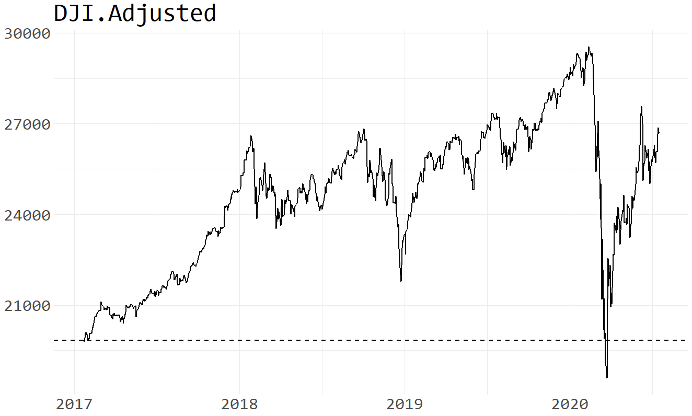
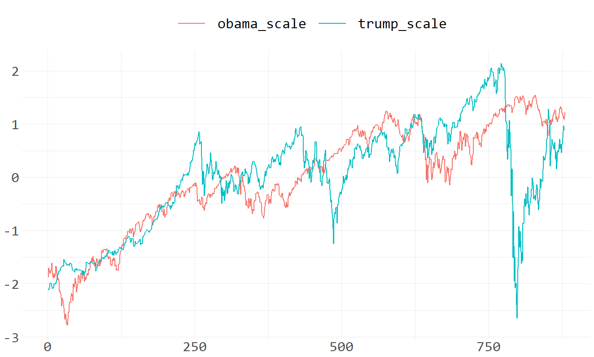

The Dow Jones Industrial Average
================
<https://am-consulting.co.jp> , <https://twitter.com/amc_corporation>
2020-05-30 07:20:17 JST

    $quantmod
    [1]  0  4 17
    
    $dplyr
    [1] 0 8 5
    
    $ggplot2
    [1] 3 3 0
    
    $tidyr
    [1] 1 1 0
    
    $PerformanceAnalytics
    [1] 1 5 3

    [1] "R version 3.6.3 (2020-02-29)"

``` r
windowsFonts(Consolas = windowsFont("Consolas"))
```

-----

## Get DJI historical price

``` r
dji0 <- getSymbols.yahoo('^DJI',auto.assign = F) %>% data.frame(Date=index(.),.,stringsAsFactors = F,check.names = F,row.names = NULL)
```

## Head

``` r
head(dji0)
```

``` 
        Date DJI.Open DJI.High  DJI.Low DJI.Close DJI.Volume DJI.Adjusted
1 2007-01-03 12459.54 12580.35 12404.82  12474.52  327200000     12474.52
2 2007-01-04 12473.16 12510.41 12403.86  12480.69  259060000     12480.69
3 2007-01-05 12480.05 12480.13 12365.41  12398.01  235220000     12398.01
4 2007-01-08 12392.01 12445.92 12337.37  12423.49  223500000     12423.49
5 2007-01-09 12424.77 12466.43 12369.17  12416.60  225190000     12416.60
6 2007-01-10 12417.00 12451.61 12355.63  12442.16  226570000     12442.16
```

## Tail

``` r
tail(dji0)
```

``` 
           Date DJI.Open DJI.High  DJI.Low DJI.Close DJI.Volume DJI.Adjusted
3370 2020-05-21 24564.27 24718.46 24370.88  24474.12  346770000     24474.12
3371 2020-05-22 24461.98 24481.64 24294.07  24465.16  255660000     24465.16
3372 2020-05-26 24781.84 25176.42 24781.84  24995.11  424380000     24995.11
3373 2020-05-27 25298.63 25551.56 25009.87  25548.27  411230000     25548.27
3374 2020-05-28 25697.36 25758.79 25358.73  25400.64  377800000     25400.64
3375 2020-05-29 25324.15 25482.80 25031.67  25383.11  545144765     25383.11
```

## Adjusted price

``` r
dji <- colnames(dji0) %>% grep('date|adjusted',.,ignore.case = T) %>% dji0[,.]
tail(dji)
```

``` 
           Date DJI.Adjusted
3370 2020-05-21     24474.12
3371 2020-05-22     24465.16
3372 2020-05-26     24995.11
3373 2020-05-27     25548.27
3374 2020-05-28     25400.64
3375 2020-05-29     25383.11
```

## Highest price

``` r
dji[,2] %>% max() %>% {.==dji[,2]} %>% dji[.,]
```

``` 
           Date DJI.Adjusted
3301 2020-02-12     29551.42
```

## Lowest price

``` r
dji[,2] %>% min() %>% {.==dji[,2]} %>% dji[.,]
```

``` 
          Date DJI.Adjusted
549 2009-03-09      6547.05
```

## The Obama administration

``` r
obama <- dji %>% filter(as.Date('2009-1-20') <= Date & Date < as.Date('2017-1-20'))
ggplot(mapping = aes(x = obama[,1],y = obama[,2])) + theme_minimal() + geom_line(size = 1) + geom_vline(xintercept = as.Date('2016-11-8'),linetype = 'dashed',col = 'red',size = 1) + geom_hline(yintercept = obama[,2] %>% head(1),linetype = 'dashed',size = 1) + theme(text = element_text(size = 30,family = 'Consolas'),axis.title = element_blank()) + labs(title = colnames(obama)[2])
```

<!-- -->

#### Percentage change from first day

``` r
obama %>% {rbind(head(.,1),tail(.,1))}
```

``` 
           Date DJI.Adjusted
1    2009-01-20      7949.09
2015 2017-01-19     19732.40
```

``` r
obama[,2] %>% {(tail(.,1)/head(.,1)-1)*100} %>% signif(7) %>% paste0('%')
```

    [1] "148.2347%"

#### Percentage change from first day to November 8, 2016

``` r
obama20161108 <- obama %>% {rbind(head(.,1),filter(.,Date==as.Date('2016-11-8')))} %>% data.frame(row.names = NULL)
obama20161108
```

``` 
        Date DJI.Adjusted
1 2009-01-20      7949.09
2 2016-11-08     18332.74
```

``` r
obama20161108[,2] %>% {(tail(.,1)/head(.,1)-1)*100} %>% signif(7) %>% paste0('%')
```

    [1] "130.6269%"

## The Trump administration

``` r
trump <- dji %>% filter(as.Date('2017-1-20') <= Date)
ggplot(mapping = aes(x = trump[,1],y = trump[,2])) + theme_minimal() + geom_line(size = 1) + geom_hline(yintercept = trump[,2] %>% head(1),linetype = 'dashed',size = 1) + theme(text = element_text(size = 30,family = 'Consolas'),axis.title = element_blank()) + labs(title = colnames(trump)[2])
```

<!-- -->

#### Percentage change from first day

``` r
trump %>% {rbind(head(.,1),tail(.,1))}
```

``` 
          Date DJI.Adjusted
1   2017-01-20     19827.25
845 2020-05-29     25383.11
```

``` r
trump[,2] %>% {(tail(.,1)/head(.,1)-1)*100} %>% signif(7) %>% paste0('%')
```

    [1] "28.02133%"

#### Percentage change from November 9, 2016

``` r
trump20161109 <- dji %>% {rbind(filter(.,Date==as.Date('2016-11-9')),tail(.,1))} %>% data.frame(row.names = NULL)
trump20161109
```

``` 
        Date DJI.Adjusted
1 2016-11-09     18589.69
2 2020-05-29     25383.11
```

``` r
trump20161109[,2] %>% {(tail(.,1)/head(.,1)-1)*100} %>% signif(7) %>% paste0('%')
```

    [1] "36.54402%"

## Compare difference between Obama and Trump

``` r
dji$change <- dji[,2] %>% {diff(.)/head(.,-1)*100} %>% round(2) %>% c(NA,.)
dji$up <- ifelse(0 < dji$change,1,0)
dji$down <- ifelse(0 > dji$change,1,0)
dji$even <- ifelse(0 == dji$change,1,0)
obama <- dji[as.Date('2009-01-20')<=dji[,1] & dji[,1]<as.Date('2017-01-20'),]
trump <- dji[as.Date('2017-01-20')<=dji[,1],]
```

#### Daily change

###### Obama

``` r
head(obama)
```

``` 
          Date DJI.Adjusted change up down even
516 2009-01-20      7949.09  -4.01  0    1    0
517 2009-01-21      8228.10   3.51  1    0    0
518 2009-01-22      8122.80  -1.28  0    1    0
519 2009-01-23      8077.56  -0.56  0    1    0
520 2009-01-26      8116.03   0.48  1    0    0
521 2009-01-27      8174.73   0.72  1    0    0
```

``` r
tail(obama)
```

``` 
           Date DJI.Adjusted change up down even
2525 2017-01-11     19954.28   0.50  1    0    0
2526 2017-01-12     19891.00  -0.32  0    1    0
2527 2017-01-13     19885.73  -0.03  0    1    0
2528 2017-01-17     19826.77  -0.30  0    1    0
2529 2017-01-18     19804.72  -0.11  0    1    0
2530 2017-01-19     19732.40  -0.37  0    1    0
```

###### Highest appreciation rate

``` r
obama$change %>% max(na.rm = T) %>% {obama[obama$change==.,c(1,2,3)]} %>% na.omit()
```

``` 
          Date DJI.Adjusted change
559 2009-03-23      7775.86   6.84
```

###### Highest decline rate

``` r
obama$change %>% min(na.rm = T) %>% {obama[obama$change==.,c(1,2,3)]} %>% na.omit()
```

``` 
           Date DJI.Adjusted change
1159 2011-08-08     10809.85  -5.55
```

###### Trump

``` r
head(trump)
```

``` 
           Date DJI.Adjusted change up down even
2531 2017-01-20     19827.25   0.48  1    0    0
2532 2017-01-23     19799.85  -0.14  0    1    0
2533 2017-01-24     19912.71   0.57  1    0    0
2534 2017-01-25     20068.51   0.78  1    0    0
2535 2017-01-26     20100.91   0.16  1    0    0
2536 2017-01-27     20093.78  -0.04  0    1    0
```

``` r
tail(trump)
```

``` 
           Date DJI.Adjusted change up down even
3370 2020-05-21     24474.12  -0.41  0    1    0
3371 2020-05-22     24465.16  -0.04  0    1    0
3372 2020-05-26     24995.11   2.17  1    0    0
3373 2020-05-27     25548.27   2.21  1    0    0
3374 2020-05-28     25400.64  -0.58  0    1    0
3375 2020-05-29     25383.11  -0.07  0    1    0
```

###### Highest appreciation rate

``` r
trump$change %>% max(na.rm = T) %>% {trump[trump$change==.,c(1,2,3)]} %>% na.omit()
```

``` 
           Date DJI.Adjusted change
3329 2020-03-24     20704.91  11.37
```

###### Highest decline rate

``` r
trump$change %>% min(na.rm = T) %>% {trump[trump$change==.,c(1,2,3)]} %>% na.omit()
```

``` 
           Date DJI.Adjusted change
3323 2020-03-16     20188.52 -12.93
```

#### Scaling

``` r
scaledf <- data.frame(Days=seq(nrow(trump)),obama_scale=head(obama[,2],nrow(trump)) %>% scale(),trump_scale = trump[,2] %>% scale())
tidydf <- gather(data = scaledf,key = 'key',value = 'DJI',colnames(scaledf)[-1])
ggplot(data = tidydf,mapping = aes(x = Days,y = DJI,col = key)) + geom_line(size = 1) + theme_minimal() + theme(legend.position = 'top',legend.title = element_blank(),legend.key.size = unit(2,"cm"),text = element_text(size = 30,family = 'Consolas'),axis.title = element_blank()) 
```

<!-- -->

#### Pearson’s Chi-squared test

``` r
tableObservation <- tableExpectation <- data.frame()
# observation
O11 <- sum(obama$up,na.rm = T)
O12 <- sum(obama$down,na.rm = T)
O21 <- sum(trump$up,na.rm = T)
O22 <- sum(trump$down,na.rm = T)
O13 <- O11+O12
O23 <- O21+O22
O31 <- O11+O21
O32 <- O12+O22
total <- O31+O32
tableObservation[1,1] <- O11
tableObservation[1,2] <- O12
tableObservation[1,3] <- O13
tableObservation[2,1] <- O21
tableObservation[2,2] <- O22
tableObservation[2,3] <- O23
tableObservation[3,1] <- O31
tableObservation[3,2] <- O32
tableObservation[3,3] <- total
# expectation
tableExpectation[1,1] <- round(O31/total*O13)
tableExpectation[1,2] <- O13-tableExpectation[1,1]
tableExpectation[1,3] <- tableExpectation[1,1]+tableExpectation[1,2]
tableExpectation[2,1] <- round(O31/total*O23)
tableExpectation[2,2] <- O23-tableExpectation[2,1]
tableExpectation[2,3] <- tableExpectation[2,1]+tableExpectation[2,2]
tableExpectation[3,1] <- tableExpectation[1,1]+tableExpectation[2,1]
tableExpectation[3,2] <- tableExpectation[1,2]+tableExpectation[2,2]
tableExpectation[3,3] <- tableExpectation[3,1]+tableExpectation[3,2]
# col,row names
colnames(tableObservation) <- colnames(tableExpectation) <- c('Up','Down','Total')
row.names(tableObservation) <- row.names(tableExpectation) <- c('Obama','Trump','Total')
```

``` r
tableObservation
```

``` 
        Up Down Total
Obama 1080  925  2005
Trump  468  371   839
Total 1548 1296  2844
```

``` r
tableExpectation
```

``` 
        Up Down Total
Obama 1091  914  2005
Trump  457  382   839
Total 1548 1296  2844
```

``` r
cross_data0 <- data.frame(POTUS = c("Obama","Obama","Trump","Trump"),Change = rep(c("Up","Down"),2),frequency = c(tableObservation[1,1],tableObservation[1,2],tableObservation[2,1] ,tableObservation[2,2]))
cross_data0
```

``` 
  POTUS Change frequency
1 Obama     Up      1080
2 Obama   Down       925
3 Trump     Up       468
4 Trump   Down       371
```

``` r
cross_data <- xtabs(formula = frequency ~ .,data = cross_data0)
cross_data
```

``` 
       Change
POTUS   Down   Up
  Obama  925 1080
  Trump  371  468
```

``` r
chisq.test(cross_data,correct = F)
```

``` 

    Pearson's Chi-squared test

data:  cross_data
X-squared = 0.87484, df = 1, p-value = 0.3496
```

-----

###### Reference & Source

1.  <https://finance.yahoo.com/>
2.  <https://stackoverflow.com/questions/39814916/how-can-i-see-output-of-rmd-in-github>
3.  <https://logics-of-blue.com/chi-squared-test/>
4.  <https://www.juen.ac.jp/psych/nakayama/chi2.html>
5.  <http://www.ritsumei.ac.jp/page.jsp?id=120821&date=2018-03-09>
